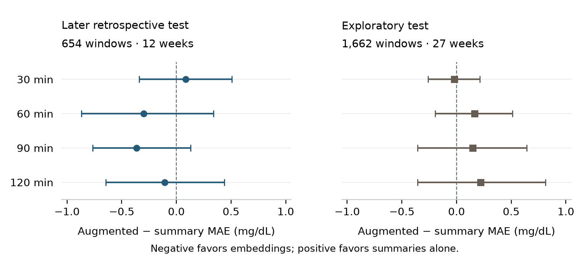

# Do frozen glucose embeddings add value beyond simple summaries?

[](https://github.com/useribraim/glucose-embeddings-evaluation/actions/workflows/ci.yml)

**Measured result:** on 654 later-test windows, adding OpenCGM-StateEvent features
to glucose-summary Ridge changed 60-minute MAE by **−0.30 mg/dL**, with a paired
95% interval of **−0.87 to +0.34**. All eight horizon-by-period intervals included
zero. The frozen community encoder did not establish additional forecasting value.

| Later retrospective test: 12 weeks | 60-minute MAE, mg/dL |
|---|---:|
| Persistence | 42.59 |
| Eight glucose/time summaries + Ridge | 37.66 |
| Same summaries + 128 frozen encoder features + Ridge | 37.36 |

[**Read the eight-page paper**](paper/glucose-embeddings-preprint.pdf) ·
[Manuscript](ARTICLE.md) · [All results](assets/article/opencgm-results.json) ·
[Frozen protocol](TANDEM.md) · [Measured evidence](assets/article/README.md)



## Verify it in one command

Requires **Python 3.14** and an internet connection for the first run. From a fresh clone:

```sh
python3 demo.py
```

The command creates an isolated environment, installs the pinned runtime, then:

1. Downloads the revision-pinned public checkpoint and corresponding source files.
2. Verifies every download's SHA-256, including matching the GitHub and Hugging Face encoder bytes.
3. Runs local CPU inference on constant, ramp, sinusoidal, sparse and empty synthetic inputs.
4. Executes the **seven original scientific-contract tests** and **four download-integrity tests**.
5. Writes the actual environment, hashes and outcomes to `.demo-output/report.json`.

Expected final output:

```text
PASS — frozen encoder on synthetic glucose, 7 scientific contract tests, 4 download-integrity tests.
CPU only; no CareLink inputs, personal embeddings or personal predictions used.
Report: .demo-output/report.json
```

Subsequent cached runs can use `python3 demo.py --offline`. Downloads are cached
under `.cache/opencgm/`. The demo verifies executable inference and evaluation
contracts; reproducing the paper's personal forecast scores requires the private
CareLink inputs. The CI job runs the same command on Ubuntu CPU without secrets.

## What the engineering checks establish

- **Checkpoint identity:** exact revision, file hashes, tensor shapes, units and embedding extraction.
- **Causal input boundaries:** observed-only glucose bins; future readings cannot enter history.
- **Clock handling:** ambiguous clock days exclude whole history/target support; original records remain intact.
- **Leakage controls:** full-support temporal purging, training-only scaling and fitting, validation-only tuning.
- **Paired uncertainty:** every arm uses identical events; week resampling retains unequal event counts correctly.
- **Artifact integrity:** corrupt cached or downloaded weights stop the demo before inference.

The personal evaluation used 11,044 eligible windows from 15 exports spanning
May 2023–September 2026. Its later test is retrospective; the January–June 2026
slice is explicitly exploratory. Losses receive the same reporting as gains.
The study is complete at this checkpoint.

## Model attribution

This evaluates **OpenCGM-StateEvent**, an independent community reconstruction,
**seed 17 / epoch 40**. It does not evaluate Google's GlucoFM weights.

- [Model](https://huggingface.co/sfourdrinier/opencgm-stateevent/tree/6c53e572c2dafcb0b030f2e1aa4f3a2a8d7f7ca3)
- [Corresponding source](https://github.com/sfourdrinier/opencgm/tree/bcf8ac2dfca00f8fb3c7728fb2a3a2bd2803bebf)
- Encoder SHA-256: `b1349deffd15ab62a5a98d7c7c4a7e143bcf1dee7ad745b1e05533ff54f34768`

The checkpoint's pretraining history remains maintainer-reported. Its encoder is
licensed CC-BY-NC-4.0; upstream source is Apache-2.0. The demo downloads those
artifacts from their pinned public locations; model weights and personal records
are not included in this repository. See [third-party provenance](NOTICE.md).

## Repository map

| Path | Purpose |
|---|---|
| `demo.py`, `scripts/`, `.github/workflows/ci.yml` | Public bootstrap, synthetic adapter and CPU CI |
| `carelink-local/` | Byte-identical measured evaluation scripts and seven original tests |
| `demo-lock.json` | Public download URLs, revisions, sizes and SHA-256s |
| `release-manifest.json` | Explicit publication allowlist and file fingerprints |
| `assets/article/` | Non-reconstructive aggregate evidence and paired-effect figure |
| `paper/` | PDF, editable typesetting source and aggregate-only paper builder |

The public adapter changes cache locations and the smoke-report output sink only;
the original inference, preprocessing, fitting and uncertainty functions retain
their measured-run fingerprints. `context_comparison.py` is included because the
completed comparison imports its Ridge helpers; its historical meal experiment is
not part of the public demo. [Paper build instructions](paper/README.md).

Author: **Ibraim Abduramanov**. [Citation metadata](CITATION.cff).
